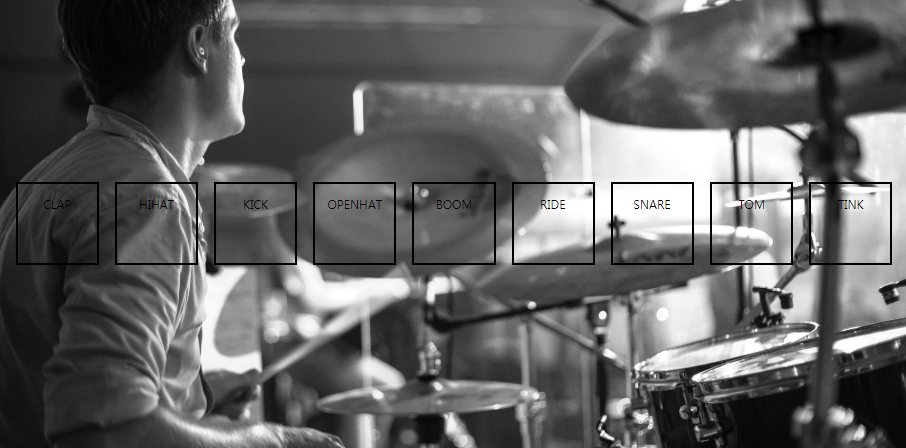

# javascript30-drumKit
Keyboard drum kit(Vanilla javascript coding challenge day1)

## Getting Started
This is a simple keyboard drum kit.

## Running the tests
No installation. Just fork this repository and pull it to your local enviroment, run index.html on internet browser(in my case, Chrome). Or, click [here](https://ginnyang2.github.io/javascript30-drumKit/)

### Break down into end to end tests
Press your 'a, s, d, f, g, h, j, k, l' keys which are correspond to each drum kit 'clap, hihat, kick, openhat, boom, ride, snare, tom, tink'. Check each sounds of all drum kit elements with simple key press animation.

  

### And coding style tests

All keys are linked to one key press eventlistener includes sound and animation effect.
There are no problem of events overlapping.
But I suppose that it is better to use 'keyCode' way of event listening which is 9 listeners link to each keys.

## Built With
No frameworks x No compilers x No libraries x No boilerplate. Vanilla JavaScript!

## Authors
Gi-baek lee, first commit, No contribution. [More about me, LinkedIn](https://www.linkedin.com/in/kibaeklee)

## License
- Course Name: Javascript 30
- Course Instructor: Wes Bros
- Course Web site: [JavaScript30](https://javascript30.com/)
- Drumkit sounds: [Wes Bros Github page](https://github.com/wesbos/JavaScript30/tree/master/01%20-%20JavaScript%20Drum%20Kit/sounds)
- Background Image: [PIXABAY](https://pixabay.com/)
